# Automatic Code Review Crew

Un sistema de múltiples agentes construido con **CrewAI** que revisa automáticamente pull requests para calidad de código y vulnerabilidades de seguridad. Demuestra memoria, guardrails y execution hooks.

---

## Tabla de Contenido

1. [Resumen](#resumen)
    - [Diagrama de Agentes y Tareas](#diagrama-de-agentes-y-tareas)
2. [Fundamentos de CrewAI](#fundamentos-de-crewai)
   - [¿Qué es CrewAI?](#qué-es-crewai)
   - [Componentes Clave](#componentes-clave)
   - [Agentes](#agentes)
   - [Tareas](#tareas)
   - [Crews](#crews)
   - [Tools](#tools)
   - [Memory](#memory)
   - [Guardrails](#guardrails)
   - [Execution Hooks](#execution-hooks)
   - [Process Types](#process-types)
3. [Arquitectura de la Aplicación](#arquitectura-de-la-aplicación)
    - [Cobertura OWASP Top 10](#cobertura-owasp-top-10)
    - [Tarea de Reporte de Recomendaciones](#tarea-de-reporte-de-recomendaciones)
4. [Instalación](#instalación)
5. [Configuración](#configuración)
6. [Uso](#uso)
7. [Librerías Adicionales](#librerías-adicionales)
8. [Estructura del Proyecto](#estructura-del-proyecto)

---

## Resumen

Automatic Code Review Crew automatiza la revisión inicial de código en CI/CD con tres agentes especializados que colaboran para:

- **Analizar calidad de código**: detectar bugs, estilo y mantenibilidad.
- **Revisar seguridad**: encontrar vulnerabilidades y evaluar riesgo.
- **Tomar decisiones**: aprobar, pedir cambios o escalar a revisión humana.

### Diagrama de Agentes y Tareas



---

## Fundamentos de CrewAI

### ¿Qué es CrewAI?

CrewAI es un framework open-source para orquestar agentes autónomos. Permite definir roles, tareas y colaboración estructurada.

**Documentación oficial:** https://docs.crewai.com/

### Componentes Clave

| Componente | Descripción |
|------------|-------------|
| **Roles** | Especialidad de cada agente |
| **Focus** | Mantiene al agente en su tarea |
| **Tools** | Capacidades para obtener/procesar datos |
| **Cooperation** | Colaboración y delegación |
| **Guardrails** | Validan y protegen salidas |
| **Memory** | Recuerda interacciones previas |

### Agentes

Un **Agent** es una unidad autónoma con rol, meta y backstory.

#### Atributos clave

```python
from crewai import Agent

agent = Agent(
    role="Data Analyst",
    goal="Extract actionable insights",
    backstory="You're an expert analyst...",
    verbose=True,
    tools=[search_tool],
    allow_delegation=False,
    max_iter=20,
    max_rpm=10,
)
```

### Tareas

Una **Task** es una asignación concreta con éxito esperado.

```python
from crewai import Task

task = Task(
    description="Analyze the code for security issues...",
    expected_output="A JSON report with vulnerabilities...",
    agent=security_agent,
    output_json=SecurityReportSchema,
    guardrails=[validation_function],
    context=[previous_task],
    markdown=True,
)
```

### Crews

Un **Crew** coordina agentes y tareas.

```python
from crewai import Crew

crew = Crew(
    agents=[agent1, agent2, agent3],
    tasks=[task1, task2, task3],
    memory=True,
    process=Process.sequential,
    before_kickoff_callbacks=[read_hook],
    after_kickoff_callbacks=[save_hook],
)
```

### Tools

Herramientas integradas (via `crewai_tools`) como `SerperDevTool` y `ScrapeWebsiteTool` para búsqueda y scraping.

### Memory

Permite recordar patrones y resultados entre ejecuciones.

### Guardrails

Validan y transforman salidas antes de pasar al siguiente paso.

### Execution Hooks

Callbacks antes y después de la ejecución para preparar entradas o persistir resultados.

### Process Types

`Process.sequential` o `Process.hierarchical` para ordenar tareas.

---

## Arquitectura de la Aplicación

Tres agentes, tres tareas, con flujo izquierda→derecha:

- **Senior Developer → Analyze Code Quality** genera hallazgos críticos/menores.
- **Security Engineer → Review Security** evalúa vulnerabilidades, riesgo, bloqueo y mapea OWASP.
- **Tech Lead → Make Review Decision** combina resultados y decide aprobar/solicitar cambios/escalar.

Memory está habilitado y guardrails validan la salida de seguridad y la decisión final.

### Cobertura OWASP Top 10

`review_security` mapea hallazgos al OWASP Top 10 (A01–A10). Su salida incluye `owasp_top_10` con `id`, `name`, `status` (`not_observed`, `needs_attention`, `confirmed`) y `evidence` o motivo `not_applicable`. Cada vulnerabilidad en `security_vulnerabilities` referencia la categoría OWASP.

### Tarea de Reporte de Recomendaciones

`write_recommendation_report` genera un Markdown en report/recommendations.md con: hallazgos de calidad, seguridad (OWASP), decisión final y fixes priorizados.

---

## Instalación

### Prerrequisitos

- Python 3.10+
- OPENAI_API_KEY
- SERPER_API_KEY (opcional para búsqueda web)

### Setup

```bash
python -m venv venv
source venv/bin/activate  # Windows: venv\Scripts\activate
pip install "crewai[tools]==1.3.0" pydantic pyyaml
```

---

## Configuración

### Agentes (`config/agents.yaml`)
Define roles, metas y backstories.

### Tareas (`config/tasks.yaml`)
Define descripciones y salidas esperadas.

---

## Uso

1. Coloca tu diff en `code_changes.txt` (o establece CODE_CHANGES_FILE en `.env`).
2. Ejecuta:

```bash
python main.py
```

3. Revisa la decisión final en consola y el reporte en `report/recommendations.md`.

---

## Librerías Adicionales

| Librería | Versión | Propósito |
|----------|---------|-----------|
| `crewai[tools]` | 1.3.0 | Framework multi-agente |
| `pydantic` | 2.x | Validación de datos |
| `pyyaml` | 6.x | Parseo YAML |

Herramientas: `SerperDevTool`, `ScrapeWebsiteTool`.

---

## Estructura del Proyecto

```
automatic_code_review_crew/
├── main.py
├── config/
│   ├── agents.yaml
│   └── tasks.yaml
├── code_changes.txt
├── report/
│   └── recommendations.md
└── README.md / README.es.md
```

---

## Guía de Implementación

1. Configura entorno y llaves.
2. Ajusta agentes y tareas en YAML.
3. Coloca tu diff en `code_changes.txt`.
4. Ejecuta `python main.py`.
5. Interpreta resultados: aprobar / request changes / escalate.

---

## Referencias

- [CrewAI Documentation](https://docs.crewai.com/)
- [CrewAI GitHub](https://github.com/crewAIInc/crewAI)
- [Pydantic](https://docs.pydantic.dev/)
- [OWASP](https://owasp.org/)

---

## Licencia

Proyecto para fines educativos. Ver licencia de CrewAI para términos del framework.
